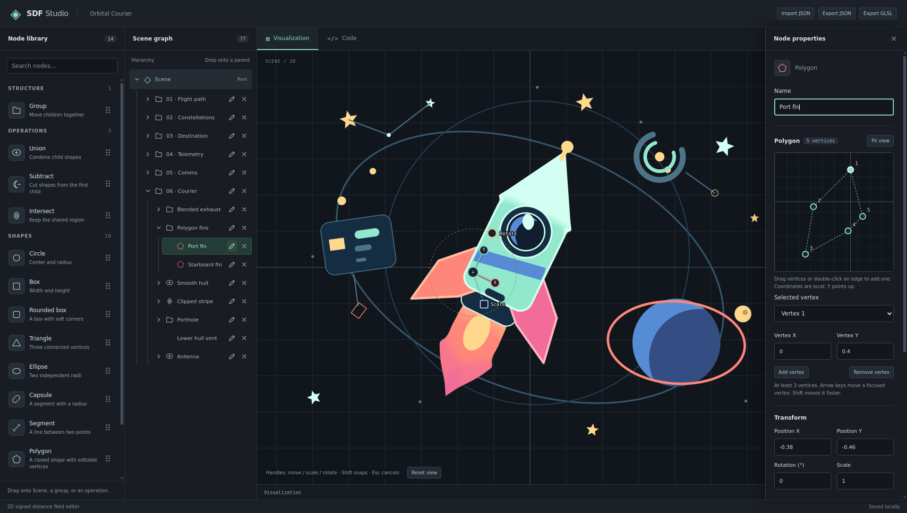

<h1 align="center">SDF Studio</h1>

<p align="center">
  
</p>

<p align="center">
  <a href="https://linkdd.github.io/sdf-studio">https://linkdd.github.io/sdf-studio</a>
</p>

---

SDF Studio is a visual editor for 2D signed distance fields. Compose shapes with
Boolean operations, edit them in a live WebGL2 preview, and export your scene as
JSON or embeddable GLSL.

# Build & Run

Install dependencies and start the development server:

```sh
npm install
npm run dev
```

Build and preview the production app:

```sh
npm run build
npm run preview
```

Format the source code, or check its formatting:

```sh
npm run format
npm run format:check
```

Pushes to `main` run lint, tests, and a production build, then publish `dist/` to
the `gh-pages` branch. The build uses the repository name as its base path.

After the first run, open **Settings → Pages**, select **Deploy from a branch**,
and choose **gh-pages** with **/ (root)**. You can then rerun the workflow from
the **Actions** tab if needed.

# Documentation

See [docs/README.md](docs/README.md) for more information.

# License

SDF Studio is released under the terms of the [MIT License](./LICENSE.txt).
